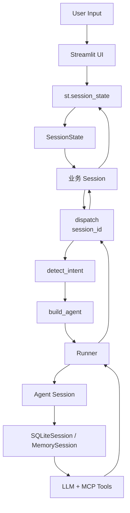

## 项目流程图

```mermaid
  flowchart TD
    %% UI Layer
    A1[User Input] --> A2[Streamlit UI]
    A2 --> B[st.session_state]

    %% Business Layer
    B --> C1[SessionState]
    C1 --> C2[业务 Session]
    C2 --> D[dispatch<br/>session_id]

    %% Dispatcher Layer
    D --> E[detect_intent]
    E --> F[build_agent]

    %% Agent Runtime Layer
    F --> G[Runner]
    G --> H1[Agent Session]
    H1 --> H2[SQLiteSession / MemorySession]

    %% Execution Layer
    H2 --> I[LLM + MCP Tools]
    I --> G

    %% 回流关系
    G --> D
    D --> C2
    C2 --> B


```
