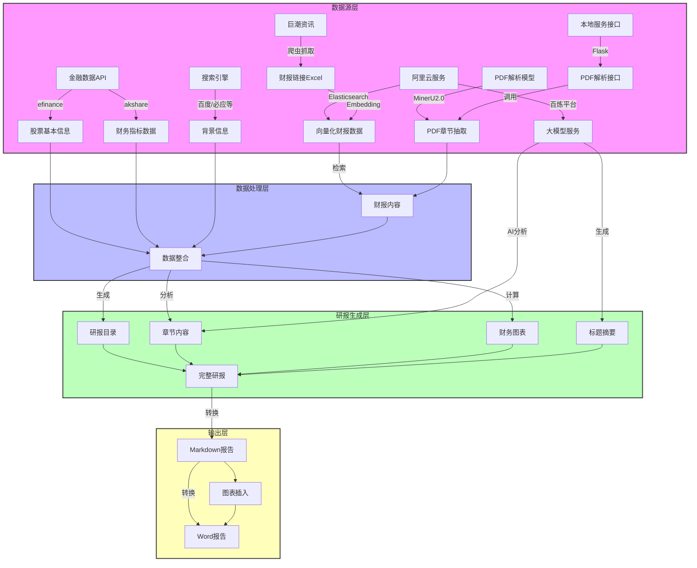
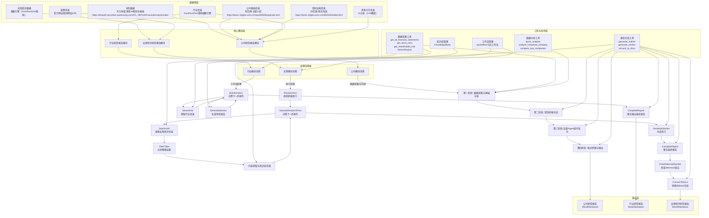
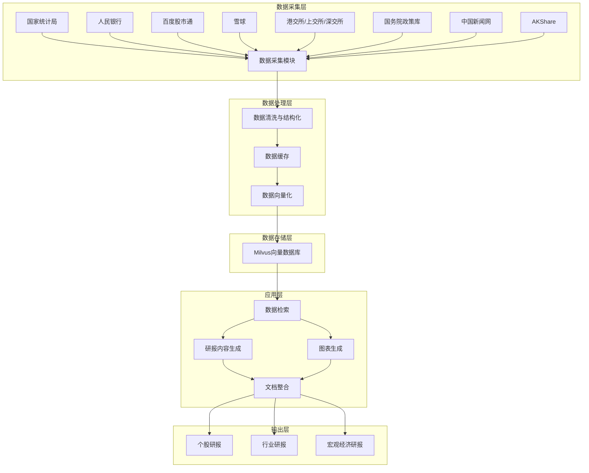

## 【方案-天池三轮车】
### 1 项目结构目录

```text
app/
├── 核心生成器
│   ├── run_company_research_report.py          # 公司研报生成器
│   ├── run_industry_research_report.py         # 行业研报生成器
│   └── run_macro_research_report.py            # 宏观研报生成器
│
├── 子生成器
│   ├── abstract_generator.py                   # 财报信息摘要生成器
│   ├── catelogue_generator.py                  # 研报目录生成器
│   ├── competitor_result_generator.py          # 竞对生成器
│   ├── section_generator.py                    # 段落内容生成器
│   ├── headline_abstract_generator.py          # 标题摘要生成器
│   ├── react_generator.py                      # 配图位置生成器
│   └── word_generator.py                       # word生成器
│
├── 工具
│   ├── agent_api/
│   │   ├── app.py                              # RAG：PDF数据Embedding及财报检索查询接口
│   │   ├── easy_demo.py                        # mineru2.0抽取PDF章节
│   │   ├── metrics_draw.py                     # 绘制图智能体
│   │   ├── parse_pdf_v1.py                     # flask提供的PDF目录章节识别及内容抽取接口
│   ├── search_api.py                           # 搜索API，基于src内的函数封装
│   ├── src/                                    
│       ├── config.py                           # 配置读取代码
│       ├── tool
│           ├── search
│           │   ├── baidu_search.py             # baidu爬虫   
│           │   ├── bing_search.py              # bing爬虫
│           │   ├── duckduckgo_search.py        # duckduckgo爬虫
│           │   ├── google_search.py            # Google爬虫
│           └── web_search.py                   # 基于search封装的web_search接口
├── 输出结果
│   ├── reports/                                # 生成的报告的目录
│   └── workspace/                              # 绘图智能体生成的工作目录
```

### 2 数据处理逻辑


### 数据源信息表

| 数据源名称 | 类型 | 来源 | 用途 | 处理方式 | 存储位置 |
|------------|------|------|------|----------|----------|
| 巨潮资讯财报链接 | 网页数据 | 巨潮资讯网站 | 获取上市公司财报 PDF 链接 | 爬虫抓取 → 存储为 Excel | combined_results/ 目录下的 Excel 文件 |
| 股票基本信息 | API 数据 | efinance 库 | 获取股票基本信息（公司概况、行业等） | 直接调用 API 获取 | 内存中处理，不持久化存储 |
| 财务指标数据 | API 数据 | akshare 库 | 获取详细财务指标（毛利率、净利率、ROE 等） | 直接调用 API 获取 | 内存中处理，不持久化存储 |
| 外部背景信息 | 网页数据 | 百度、必应等搜索引擎 | 获取公司及行业背景信息、新闻等 | 通过 WebSearch 工具调用搜索引擎 | 内存中处理，不持久化存储 |
| 财报 PDF 文件 | 文档数据 | 巨潮资讯网站 | 提供财报详细内容 | 下载 → 解析 → 提取关键章节 | agent_api/pdf_path/ 目录 |
| 向量化财报数据 | 向量数据 | Elasticsearch | 存储和检索财报链接的向量化表示 | Embedding 处理 → 存入 Elasticsearch | 阿里云 Elasticsearch 服务 |

## 【方案-好想成为人类】
### 1 项目结构目录

```text
app/
├── company/                  # 公司研究报告模块
│   ├── company_research_report_generator.py  # 公司报告生成主类
│   ├── data_analysis_agent/  # 数据分析智能体
│   └── utils/                # 工具函数（财务数据获取、股东信息等）
├── industry/                 # 行业研究报告模块
│   ├── industry_research_report.py  # 行业报告生成
│   ├── prompts/              # 提示词模板
│   └── utils/                # 工具函数
├── macro/                    # 宏观经济研究报告模块
│   ├── marco_research_report.py  # 宏观报告生成
│   └── utils/                # 工具函数
├── run.py                    # 主运行入口
└── run_*.py                  # 各模块独立运行脚本
```

### 2 数据处理逻辑



### 1. 公司研究报告模块
| 数据源名称 | 具体来源（含网页地址） | 数据格式 | 获取方式 |   
|-----|-----|-----|-----|
| 财务数据 | 东方财富-港股/A股财务报表 <br> https://emweb.securities.eastmoney.com/PC_HKF10/FinancialAnalysis/index | HTML/JSON | get_all_financial_statements 函数 |   
| 公司基础信息 | 同花顺-主营介绍 <br> https://basic.10jqka.com.cn/new/000066/operate.html | HTML | get_stock_intro 函数 |   
| 股东结构信息 | 同花顺-股东信息 <br> https://basic.10jqka.com.cn/HK0020/holder.html | HTML (表格) | get_shareholder_info 函数 |   
| 行业信息 | DuckDuckGo搜索API https://duckduckgo.com <br> 搜狗搜索 https://www.sogou.com | 搜索结果 (JSON) | SearchEngine.search 方法 |   
| 竞争对手信息 | AI分析（基于LLM模型） | 结构化数据 (JSON) | identify_competitors_with_ai 函数 |   

### 2. 行业研究报告模块
| 数据源名称 | 具体来源（含网页地址） | 数据格式 | 获取方式 | 
|-----|-----|-----|-----|
|行业信息 | 搜索引擎（未明确具体引擎） | 搜索结果 | (JSON) | search_web | 函数

### 3. 宏观经济研究报告模块
| 数据源名称 | 具体来源（含网页地址） | 数据格式 | 获取方式 | 
|-----|-----|-----|-----|
| 宏观经济数据 | 搜索引擎（DuckDuckGo/搜狗） | 搜索结果 (JSON) | SearchEngine.search 方法 | 
| 政策信息 | 官方网站、新闻网站等URL内容 | HTML/文本 | extract_content_from_url 函数 | 
| 本地知识库 | 本地文件系统 | 结构化数据 (JSON) | KnowledgeBase 类 | 

## 【方案-队伍名字不能为空】
### 1 项目结构目录

```text
├── agent/                             # agent实现
│   │── common/                            # 基础工具
│   │   ├── llm_utils.py                       # 大模型调用工具包
│   │
│   │── agent_chart.py                     # 绘图agent
│   │── agent_data.py                      # 数据管理agent
│   │── agent_industry.py                  # 行业报告agent
│   │── agent_macro.py                     # 宏观经济报告agent
│   │── agent_stock.py                     # 个股/企业agent
│ 
├── mcps/                              # mcp服务实现    
│   │── common/                            # 基础工具
│   │   ├── _cache/                            # 缓存保存目录
│   │   ├── _imgs/                             # 绘图结果保存目录
│   │   ├── fonts/                             # 绘图使用的字体
│   │   ├── cache.py                           # 缓存工具
│   │   ├── chart_utils.py                     # 绘图工具
│   │   ├── http_utils.py                      # 网络请求工具
│   │   ├── parallelism.py                     # 并行运算工具
│   │   ├── pdf_reader.py                      # pdf阅读工具
│   │   ├── util.py                            # 其他工具
│   │
│   │── spider/                            # 网络数据提取工具
│   │   ├── data_files/                        # 统计局工具下载临时目录
│   │   ├── hszs_files/                        # 恒生指数下载临时目录
│   │   ├── data_gjtjj.py                      # 国家统计局数据提取
│   │   ├── data_rmyh.py                       # 人民银行统计司数据提取
│   │   ├── financial_analysis.py              # 企业财务报表提取
│   │   ├── forex_akshare.py                   # 外汇数据
│   │   ├── futures_akshare.py                 # 期货数据
│   │   ├── index_hs.py                        # 恒生指数
│   │   ├── macro_akshare.py                   # 宏观经济数据
│   │   ├── news.py                            # 中国新闻网
│   │   ├── report_hk.py                       # 港交所
│   │   ├── report_sh.py                       # 上交所
│   │   ├── report_sz.py                       # 深交所
│   │   ├── stock_akshare.py                   # 股票数据（akshare）
│   │   ├── stock_bd.py                        # 股票数据（百度股市通）
│   │   ├── stock_xq.py                        # 股票数据（雪球）
│   │   ├── zhengce_gwy.py                     # 国务院政策文件库
│   │   ├── zhengce_rmzf.py                    # 政府网
│   │
│   │── tools/                             # 工具
│   │   ├── create_document.py                 # docx文件生成
│   │   ├── store.py                           # Milvus数据管理
│   │
│   │── data_types.py                      # 数据类型定义
│   │── server_chart.py                    # 绘图MCP服务
│   │── server_data.py                     # 数据管理MCP服务
│   │── server_news.py                     # 新闻MCP服务
│   │── server_policy.py                   # 政策与公共MCP服务
│   │── server_stock.py                    # 股票MCP服务
│   
├── results/                           # 结果目录
│   ├── Company_Research_Report.docx       # 公司研报
│   ├── Industry_Research_Report.docx      # 行业研报
│   ├── Macro_Research_Report.docx         # 宏观经济研报
```
### 2 数据处理逻辑



### 数据源信息表

| 数据源 | 数据类型 | 获取方式 | 相关代码文件 |
|--------|----------|----------|--------------|
| 国家统计局 | 宏观经济指标（GDP、CPI、PPI等） | 网页爬取 | `mcps/spider/data_gjtjj.py` |
| 人民银行统计司 | 金融市场数据（货币供应量、利率等） | 网页爬取 | `mcps/spider/data_rmyh.py` |
| 百度股市通 | 个股数据、K线图、板块信息 | API接口（需token） | `mcps/spider/stock_bd.py` |
| 雪球 | 个股数据、市场分析、投资者情绪 | 网页爬取 | `mcps/spider/stock_xq.py` |
| AKShare | 股票、外汇、期货市场数据 | Python库调用 | `mcps/spider/stock_akshare.py`<br>`mcps/spider/forex_akshare.py`<br>`mcps/spider/futures_akshare.py` |
| 企业财务报表 | 企业财务数据（资产负债表、利润表、现金流量表） | 网页爬取 | `mcps/spider/financial_analysis.py` |
| 国务院政策文件库 | 国家政策文件、法规 | 网页爬取 | `mcps/spider/zhengce_gwy.py` |
| 政府网 | 政府政策、公告 | 网页爬取 | `mcps/spider/zhengce_rmzf.py` |
| 中国新闻网 | 财经新闻、市场动态 | 网页爬取 | `mcps/spider/news.py` |
| 港交所 | 港股市场数据、上市公司信息 | 网页爬取 | `mcps/spider/report_hk.py` |
| 上交所 | A股市场数据、上市公司信息 | 网页爬取 | `mcps/spider/report_sh.py` |
| 深交所 | A股市场数据、上市公司信息 | 网页爬取 | `mcps/spider/report_sz.py` |
| 恒生指数 | 港股指数数据 | 网页爬取 | `mcps/spider/index_hs.py` |
