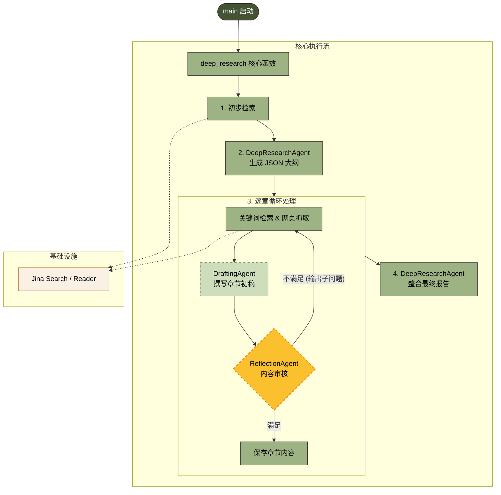
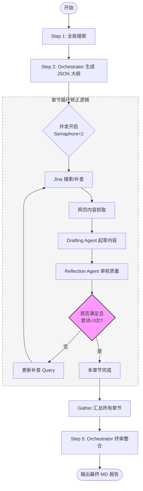

# task3
代码地址[查看源码](./09_DeepResearch.py)
## 原始架构图

```mermaid
graph TD
    %% 样式定义
    classDef entry fill:#435334,color:#fff,stroke:#333;
    classDef logic fill:#9EB384,color:#000,stroke:#333;
    classDef agent fill:#CEDEBD,color:#000,stroke:#606c38,stroke-dasharray: 5 5;
    classDef tool fill:#FAF1E4,color:#000,stroke:#bc6c25;
    classDef highlight fill:#fbc02d,stroke:#f57f17,stroke-width:2px;

    %% 入口
    M([main 启动]) --> DR[deep_research 核心函数]

    subgraph Workflow [核心执行流]
        direction TB
        DR --> S1[1. 初步检索]
        S1 --> S2[2. DeepResearchAgent <br/>生成 JSON 大纲]
        
        subgraph Section_Loop [3. 逐章循环处理]
            direction TB
            L1[关键词检索 & 网页抓取] --> L2[DraftingAgent <br/>撰写章节初稿]
            L2 --> L3{ReflectionAgent <br/>内容审核}
            L3 --"不满足 (输出子问题)"--> L1
            L3 --"满足"--> L4[保存章节内容]
        end
        
        S2 --> Section_Loop
        Section_Loop --> S5[4. DeepResearchAgent <br/>整合最终报告]
    end

    %% 工具层
    subgraph Infrastructure [基础设施]
        T1[Jina Search / Reader]
    end

    %% 调用关系
    L1 -.-> T1
    S1 -.-> T1

    %% 样式应用
    class M entry;
    class DR,S1,S2,S5,L1,L4 logic;
    class L2,L3 agent;
    class T1 tool;
    class L3 highlight;   
```
## 优化后架构图

```mermaid
graph TD
    A([开始]) --> B[Step 1: 全局搜索]
    B --> C[Step 2: Orchestrator 生成 JSON 大纲]
    C --> D{并发开启<br/>Semaphore=2}
    
    subgraph Iterative_Refinement [章节循环修正逻辑]
        D --> E[Jina 搜索/补查]
        E --> F[网页内容抓取]
        F --> G[Drafting Agent 起草内容]
        G --> H[Reflection Agent 审核质量]
        H --> I{是否满足且<br/>尝试<3次?}
        I -- 否 --> J[更新补查 Query]
        J --> E
        I -- 是 --> K[本章节完成]
    end
    
    K --> L[Gather 汇总所有章节]
    L --> M[Step 5: Orchestrator 终审整合]
    M --> N([输出最终 MD 报告])

    style I fill:#f9f,stroke:#333,stroke-width:2px
    style Iterative_Refinement fill:#f5f5f5,stroke:#666,stroke-dasharray: 5 5
```
